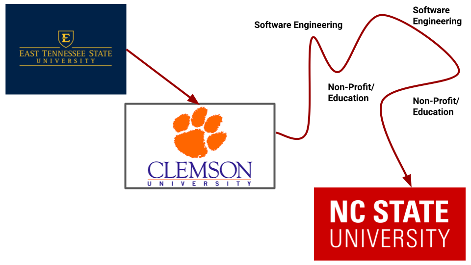

class: clear, title-slide, inverse, center, top, middle

```{r setup, include=FALSE}
knitr::opts_chunk$set(echo = FALSE)
```

```{r load-initial-packages, echo=FALSE}
# then load all the relevant packages
pacman::p_load(pacman, knitr)
```

```{r xaringan-panelset, echo=FALSE}
xaringanExtra::use_panelset()
```

```{r xaringanExtra-clipboard, echo=FALSE}
# these allow any code snippets to be copied to the clipboard so they 
# can be pasted easily
htmltools::tagList(
  xaringanExtra::use_clipboard(
    button_text = "<i class=\"fa fa-clipboard\"></i>",
    success_text = "<i class=\"fa fa-check\" style=\"color: #90BE6D\"></i>",
  ),
  rmarkdown::html_dependency_font_awesome()
)
```

```{r xaringan-extras, echo=FALSE}
xaringanExtra::use_tile_view()
```

# `r rmarkdown::metadata$title`
----
### `r rmarkdown::metadata$author`
### `r rmarkdown::metadata$institute`
### `r format(Sys.time(), "%B %d, %Y")`

---
# Every Superhero Needs an Origin Story...

- Born in the Appalachian Mountains of NE Tennessee (just like Dolly Parton!)
- Come from a VERY large family
- Diagnosed with Type I Diabetes at 9 years old
- What I wanted to be when I grew up changed everyday
 - teach Gorillas sign language, marine biologist, actress, the female version of Mr. Wizard, artist because Bob Ross

---
class:clear, inverse, no-logo, center, middle

# Lifelong Learner
--

----
"I'm going to go to school forever!"

---
class:clear, inverse, no-logo, center, middle

# Born an Educator
--

----
Getting an "U" for explaining where babies really came from...

---
class:clear, inverse, no-logo, center, middle
# First Generation College Student
---
class:clear, no-logo

---
class:clear, no-logo

---
class: no-logo
# My Academic Path



---
class: clear
background-image: url(img/iceberg.jpeg)
background-position: -320% -320% 
background-size: 100%

## **On the Surface...**

--
.pull-left[
- Publications
- Research Awards and Honor Societies
- Grants
]

.pull-right[
- Presentations 
 - NASA Science Directorate!
- Director of IT
]

---
class: clear
background-image: url(img/iceberg.jpeg)
background-position: 100% 100% 
background-size: 100%

<br/><br/>
--

.white[
- Living with invisible disabilities (Diabetes, ADHD)

- "Mastering Out" of a PhD program

- A lost job and potential homelessness

- Too many rejections to count

- Imposter Syndrome]


---
class: clear
background-image: url(img/knit.jpg)
background-position: 100% 100% 
background-size: 100%

---
class: clear
background-image: url(img/knit2.jpg)
background-position: 100% 100% 
background-size: 100%
